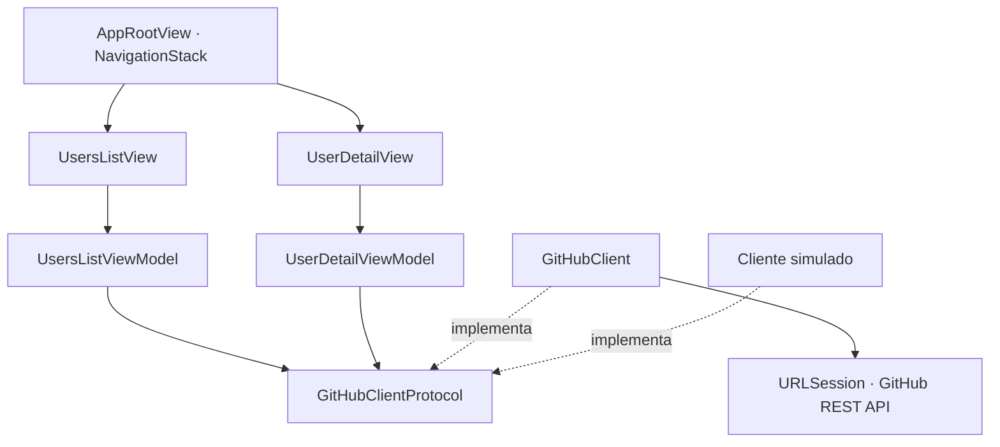

# GitHub Users

App iOS em SwiftUI para explorar usuários do GitHub e consultar seus perfis, com paginação, busca local e visualização em lista ou grade.

A estrutura usa MVVM e um pacote local para integração com a API. Os testes cobrem tanto os fluxos de navegação quanto situações como cancelamento, falha ao carregar outra página e atualização sem perder o conteúdo da tela.

## Funcionalidades

* Lista paginada com alternância entre lista e grade.
* Busca por login e nome entre os usuários já carregados.
* Perfil público com avatar em tela cheia.
* Atualização dos dados mantendo o conteúdo anterior em caso de falha.
* Estados de carregamento, lista vazia, erro e limite de requisições.
* Textos em português e inglês, rótulos de acessibilidade e suporte à redução de movimento e transparência.

A busca acontece em memória. Para incluir mais usuários nos resultados, é preciso carregar outras páginas.

## Organização do código

As Views exibem o estado dos ViewModels. A navegação entre lista e perfil fica no `NavigationStack`, em `AppRootView`.

Os ViewModels recebem um `GitHubClientProtocol`. Nos testes, um cliente simulado permite controlar as respostas e reproduzir falhas sem acessar a API.



O pacote local `GitHubAPI` reúne o cliente HTTP com `async/await`, a validação das respostas, os modelos e os caches. Usuários e perfis ficam em memória; os dados dos avatares ficam em memória e disco.

## Rodar o projeto

Requisitos:

* Xcode com toolchain Swift 6.3 ou superior.
* iOS 17 ou superior.
* macOS 14 ou superior para os testes de pacote.

```sh
git clone https://github.com/swiftdecodificado/GitHubUsers.git
cd GitHubUsers
open GitHubUsers.xcodeproj
```

No Xcode, selecione o scheme `GitHubUsers`, escolha um simulador e execute com **⌘R**.

O app funciona sem token e fica sujeito ao limite de requisições não autenticadas do GitHub.

Para rodar em um iPhone, copie `Config/Signing.xcconfig.example` para `Config/Signing.xcconfig` e preencha `DEVELOPMENT_TEAM`. Esse arquivo é ignorado pelo Git.

## Testes

Os testes unitários usam **Swift Testing** e cobrem carregamento, paginação, busca, cancelamento, recuperação de erros, respostas HTTP e caches.

Execute na raiz:

```sh
# ViewModels
swift test

# Cliente HTTP, modelos e caches
swift test --package-path Packages/GitHubAPI
```

Os testes de interface usam **XCTest**, com dados simulados, para verificar navegação, busca, troca de layout, paginação, rotação, avatar e recuperação de falhas.

Para rodar os testes pelo Xcode, use **⌘U** no scheme `GitHubUsers`.

## Configuração do projeto

O arquivo `project.yml` define a estrutura do projeto Xcode. Depois de alterá-lo, regenere o `.xcodeproj` com o XcodeGen:

```sh
xcodegen generate --spec project.yml
```

O scheme está configurado sem LLDB. Para usar breakpoints, defina `run.debugEnabled: true` em `project.yml` e regenere o projeto.

## Formatação e lint

O projeto usa [SwiftFormat](https://github.com/nicklockwood/SwiftFormat) para formatação e [SwiftLint](https://github.com/realm/SwiftLint) para verificar as convenções do código. A configuração cobre o app, os testes, os manifests e o pacote `GitHubAPI`.

Instale as ferramentas:

```sh
brew install swiftlint swiftformat
```

Para aplicar as correções e verificar o resultado, execute na raiz:

```sh
swiftlint lint --fix --no-cache
swiftformat . --cache ignore
swiftlint lint --strict --no-cache
```

Para conferir a formatação sem alterar arquivos:

```sh
swiftformat . --lint --cache ignore
```

As regras ficam em [.swiftformat](.swiftformat) e [.swiftlint.yml](.swiftlint.yml), validadas com SwiftFormat 0.63.0 e SwiftLint 0.65.0.

## Integração contínua

O workflow [Swift CI](.github/workflows/swift.yml) roda em pushes e pull requests para `main`. Também pode ser iniciado manualmente pela aba Actions.

O pipeline usa macOS 26 com Xcode 26.6 para:

1. Executar os testes dos ViewModels e do pacote `GitHubAPI`.
2. Gerar o projeto com XcodeGen.
3. Compilar o app e os targets de teste em Debug para o simulador.
4. Compilar o app em Release para o simulador.

Os builds dispensam certificados e configuração de assinatura. Os testes de interface são compilados no CI, mas a execução é local, pelo Xcode.