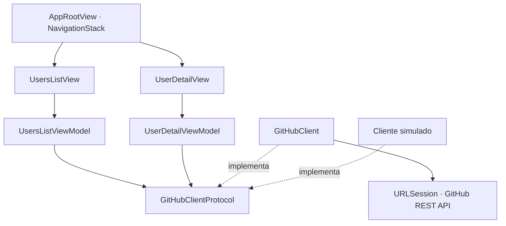

# GitHub Users

App iOS em SwiftUI para explorar usuários do GitHub e consultar seus perfis, com paginação, busca local e alternância entre lista e grade.

O projeto usa MVVM e um pacote local para acesso à API. Além da navegação, os testes cobrem situações como cancelar uma requisição, falhar ao carregar a próxima página e atualizar os dados sem perder o conteúdo que já está na tela.

<p align="center">
  
</p>

## Funcionalidades

* Lista paginada com visualização em lista ou grade.
* Busca por login e nome entre os usuários carregados.
* Perfil público e avatar em tela cheia.
* Atualização dos dados preservando o conteúdo anterior em caso de falha.
* Tratamento de carregamento, lista vazia, erros e limite de requisições.
* Textos em português e inglês, rótulos de acessibilidade e ajustes para redução de movimento e transparência.

A busca é local, sobre os dados em memória. Para ampliar os resultados, é preciso carregar mais páginas.

## Organização do código

As Views exibem o estado dos ViewModels. A navegação entre lista e perfil fica em `AppRootView`, usando `NavigationStack`.

Os ViewModels recebem um `GitHubClientProtocol`. Nos testes, essa dependência é substituída por um cliente simulado para controlar respostas, atrasos e falhas sem depender da API.



O pacote local `GitHubAPI` reúne o cliente HTTP com `async/await`, a validação das respostas, os modelos e os caches. Usuários e perfis ficam em memória. Os dados dos avatares também são salvos em disco.

### Cache de avatares

A lista, o perfil e o visualizador compartilham o cache. Downloads da mesma URL são deduplicados, e os arquivos em disco podem ser reaproveitados ao reabrir o app.

Manter esse cache também significa cuidar de expiração, descarte e cancelamento. Se uma view cancela sua espera, o download pode continuar para atender outra. Nos testes, sessão HTTP, diretório e relógio podem ser substituídos.

A configuração padrão é:

* **Memória:** 32 MiB, sujeitos à política de descarte do `NSCache`.
* **Disco:** orçamento de 100 MiB, com descarte das gravações mais antigas.
* **Validade:** sete dias. Ler um arquivo não renova sua validade.
* **Download:** respostas acima de 20 MiB são interrompidas durante a leitura.

O limite de download considera os dados acumulados pelo app. Ele não limita a memória total usada pela sessão HTTP nem pela imagem depois de decodificada.

## Rodar o projeto

Requisitos:

* Xcode com toolchain Swift 6.3 ou superior.
* iOS 17 ou superior.
* macOS 14 ou superior para os testes de pacote.

```sh
git clone https://github.com/swiftdecodificado/GitHubUsers.git
cd GitHubUsers
open GitHubUsers.xcodeproj
```

Selecione o scheme `GitHubUsers`, escolha um simulador e execute com **⌘R**.

Não é necessário configurar token. O app fica sujeito ao limite de requisições não autenticadas do GitHub.

Para rodar em um iPhone, copie `Config/Signing.xcconfig.example` para `Config/Signing.xcconfig` e preencha `DEVELOPMENT_TEAM`. Esse arquivo é ignorado pelo Git.

## Testes

Os testes unitários usam **Swift Testing** e cobrem carregamento, paginação, busca, cancelamento, recuperação de erros, respostas HTTP e caches.

Execute na raiz:

```sh
# ViewModels
swift test

# Pacote GitHubAPI
swift test --package-path Packages/GitHubAPI
```

Os testes de interface usam **XCTest** com dados simulados. Eles verificam navegação, busca, troca de layout, paginação, rotação, avatar e recuperação de falhas.

Para executar pelo Xcode, use **⌘U** no scheme `GitHubUsers`.

## Configuração do projeto

A estrutura do projeto Xcode fica em `project.yml`. Depois de alterar esse arquivo, regenere o `.xcodeproj` com o XcodeGen instalado:

```sh
xcodegen generate --spec project.yml
```

O scheme está configurado sem LLDB. Para usar breakpoints, defina `run.debugEnabled: true` em `project.yml` e regenere o projeto.

## Formatação e lint

O [SwiftFormat](https://github.com/nicklockwood/SwiftFormat) cuida da formatação, e o [SwiftLint](https://github.com/realm/SwiftLint) verifica as convenções do código. As configurações da raiz cobrem o app, os testes, os manifests e o pacote `GitHubAPI`.

Instale as ferramentas:

```sh
brew install swiftlint swiftformat
```

Para aplicar as correções e conferir o resultado:

```sh
swiftlint lint --fix --no-cache
swiftformat . --cache ignore
swiftlint lint --strict --no-cache
```

Para verificar a formatação sem modificar arquivos:

```sh
swiftformat . --lint --cache ignore
```

As regras estão em [.swiftformat](.swiftformat) e [.swiftlint.yml](.swiftlint.yml), validadas com SwiftFormat 0.63.0 e SwiftLint 0.65.0.

## Integração contínua

O workflow [Swift CI](.github/workflows/swift.yml) roda em pushes e pull requests para `main`. Também pode ser disparado manualmente pela aba Actions.

O pipeline usa macOS 26 com Xcode 26.6 e executa estas etapas:

1. Testes dos ViewModels e do pacote `GitHubAPI` via Swift Package Manager.
2. Geração do projeto com XcodeGen.
3. Build do app e dos targets de teste em Debug para o simulador.
4. Build do app em Release para o simulador.

Os builds não precisam de certificados, Team ou `Config/Signing.xcconfig`. Os testes de interface são compilados no CI; a execução continua sendo local, pelo Xcode com **⌘U**.

## Swift Decodificado

Estou criando o canal e o site do Swift Decodificado para compartilhar conteúdo sobre Swift e desenvolvimento iOS. Os dois ainda estão em construção.

* [Canal no YouTube](https://www.youtube.com/@swiftdecodificado)
* [Site Swift Decodificado](https://www.swiftdecodificado.com)
